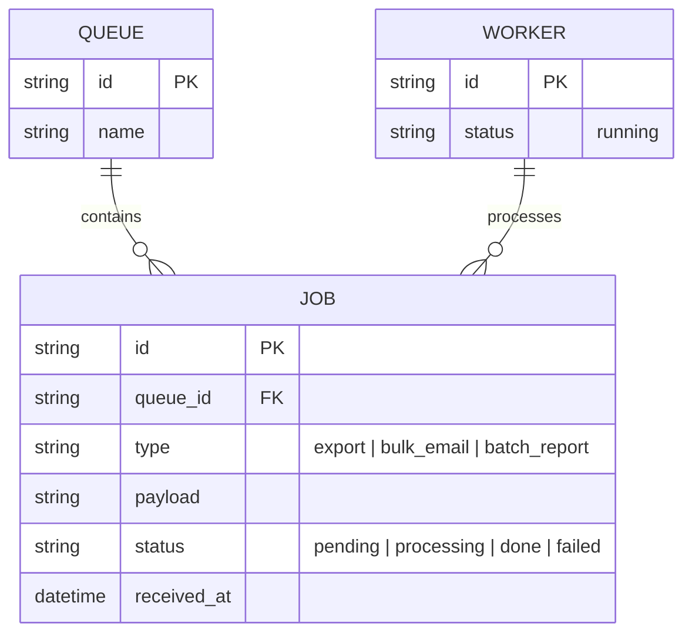

# Base ERD — Background worker consume queue trước khi có graceful shutdown

Đây là **base**: mô hình dữ liệu suy luận từ ngữ cảnh đề bài, thể hiện trạng thái hệ thống **trước khi** worker biết xử lý shutdown an toàn. Đề bài nói tới cụm worker consume message từ hàng đợi để xử lý job dài — nên base chỉ cần đủ: hàng đợi (QUEUE), job/message trong hàng đợi (JOB) và worker đang xử lý (WORKER). Chưa có checkpoint, chưa có visibility timeout theo dõi rõ ràng, chưa có trạng thái draining, chưa có kế hoạch phối hợp rolling shutdown toàn cụm — tất cả những thứ đó là phần enhance.

