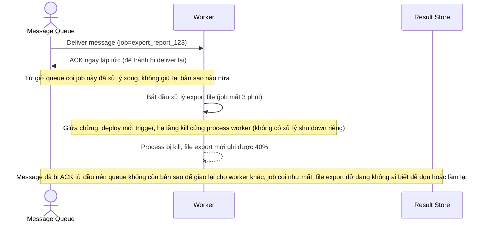

# Base sequence — Consume job (ack sớm, không chống mất dữ liệu khi crash)

Đây là **base**, flow "Worker lấy job từ queue và xử lý" ở trạng thái hiện tại — worker ack message ngay sau khi nhận (trước khi xử lý xong) để tránh bị nhận trùng, và không có cơ chế nào xử lý riêng khi có tín hiệu shutdown giữa lúc đang chạy job dài. Flow này liên quan mật thiết tới enhance vì toàn bộ yêu cầu của đề bài xoay quanh việc sửa đúng thời điểm ack và cách worker phản ứng khi bị tắt.

