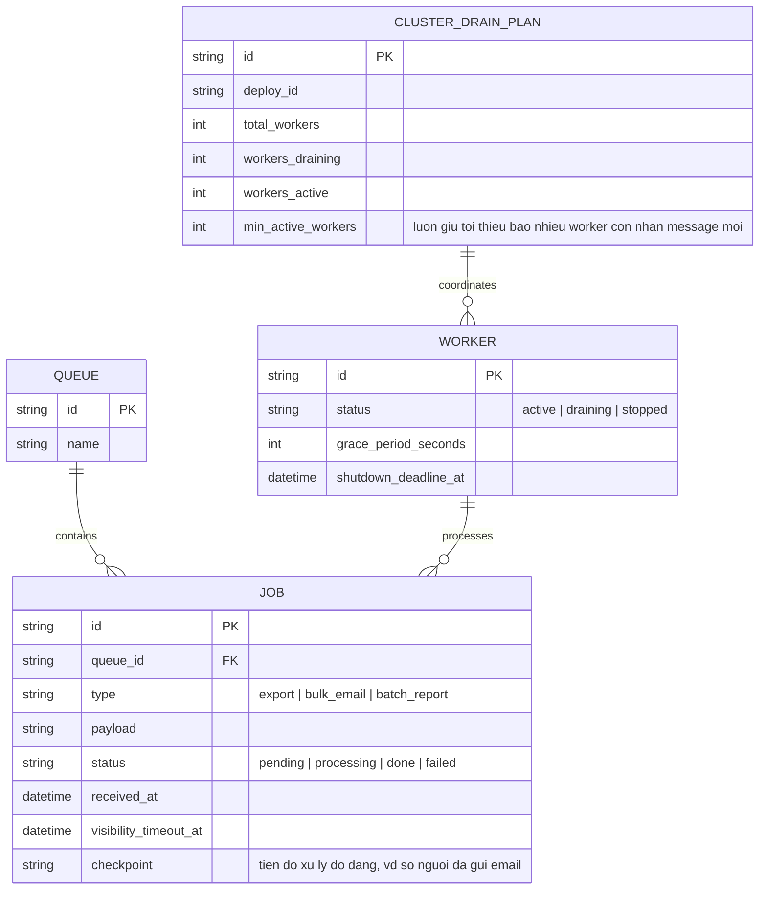

# Enhance ERD — Thêm checkpoint, visibility timeout, trạng thái draining, kế hoạch drain cụm

Đây là **enhance**, mô hình dữ liệu sau khi áp toàn bộ đề bài lên base. So với base, các thay đổi:
- `JOB` có thêm cột `visibility_timeout_at` (job coi như "đang được ai đó xử lý" tới thời điểm này, hết hạn mà chưa ack thì tự động quay lại queue) và `checkpoint` (lưu tiến độ xử lý dở, ví dụ số dòng file đã ghi/số người đã gửi email) — đáp ứng yêu cầu 2 và yêu cầu 3.
- `WORKER` có thêm trạng thái `draining` và các cột `grace_period_seconds`, `shutdown_deadline_at` — đáp ứng yêu cầu 1 và yêu cầu 4 (định nghĩa grace period rõ ràng).
- Entity mới `CLUSTER_DRAIN_PLAN` — theo dõi 1 đợt rolling deploy/scale toàn cụm, đảm bảo luôn còn tối thiểu 1 số worker ở trạng thái active nhận message mới trong lúc số còn lại đang drain — đáp ứng yêu cầu 5.

