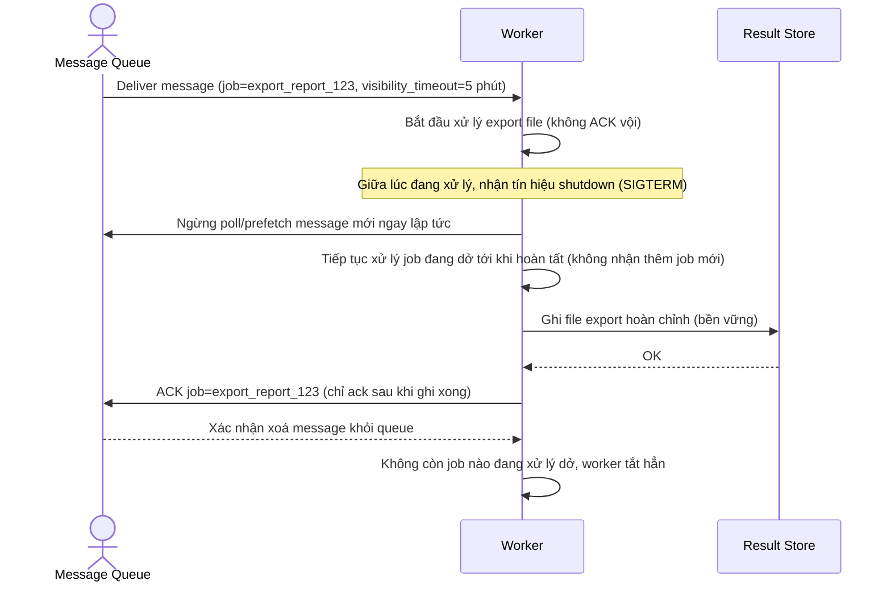

# Enhance sequence — Consume job (ngừng prefetch ngay, ack sau khi xong và ghi bền vững)

Đây là **enhance** của flow `consume-job` đã có ở base, đáp ứng **yêu cầu 1 và 2** của đề bài. So với base: khi nhận tín hiệu shutdown, worker ngừng ngay việc poll/prefetch message mới nhưng tiếp tục hoàn tất job đang xử lý dở, và chỉ ACK sau khi job đã hoàn tất toàn bộ và kết quả đã ghi bền vững — không còn ack ngay sau khi nhận message như base.

