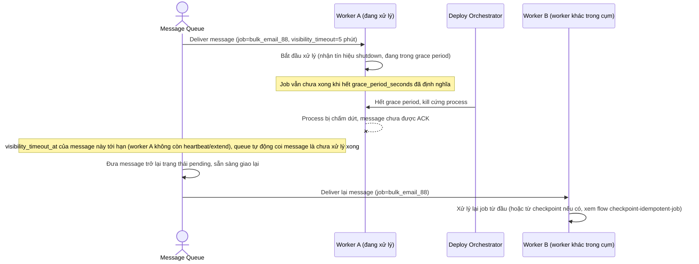

# Enhance sequence — Hết grace period, bị kill cứng, message tự động quay lại queue

Đây là flow **enhance** hoàn toàn mới so với base, đáp ứng phần còn lại của **yêu cầu 2**: nếu worker bị kill cứng giữa lúc xử lý (hết grace period mà job chưa xong), message chưa được ack phải tự động được đưa trở lại queue nhờ `visibility_timeout_at` hết hạn, để worker khác xử lý lại, không được để mất.

