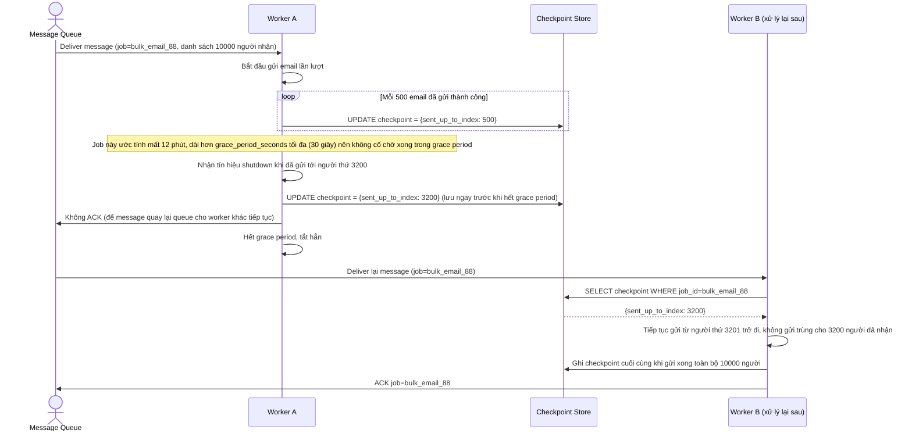

# Enhance sequence — Checkpoint cho job dài, tránh gửi trùng khi xử lý lại

Đây là flow **enhance** hoàn toàn mới so với base, đáp ứng **yêu cầu 3 và yêu cầu 4** của đề bài: job gửi email hàng loạt có thể để lại tác động một phần khi bị ngắt giữa chừng, nên phải lưu checkpoint (đã gửi tới người thứ mấy) để lần xử lý lại sau không gửi trùng. Vì job này dài hơn grace period tối đa cho phép, worker chủ động lưu checkpoint giữa chừng thay vì cố chờ chạy xong trong grace period.

