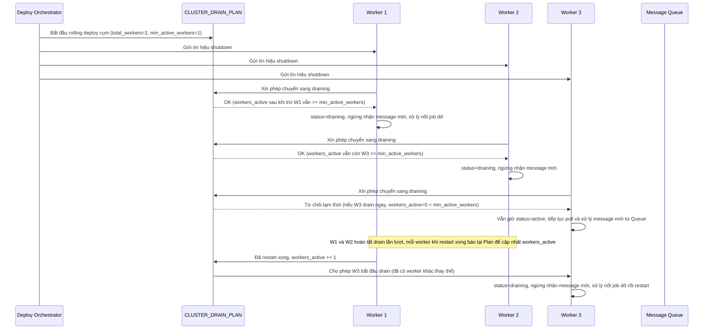

# Enhance sequence — Toàn cụm nhận tín hiệu shutdown gần đồng thời, vẫn giữ worker tiếp nhận việc mới

Đây là flow **enhance** hoàn toàn mới so với base, đáp ứng **yêu cầu 5** của đề bài: khi rolling deploy khiến toàn bộ worker trong cụm nhận tín hiệu shutdown gần như đồng thời, `CLUSTER_DRAIN_PLAN` đảm bảo luôn còn tối thiểu một số worker tiếp tục nhận message mới trong lúc số còn lại đang drain, tránh hàng đợi bị dồn ứ không ai xử lý.

