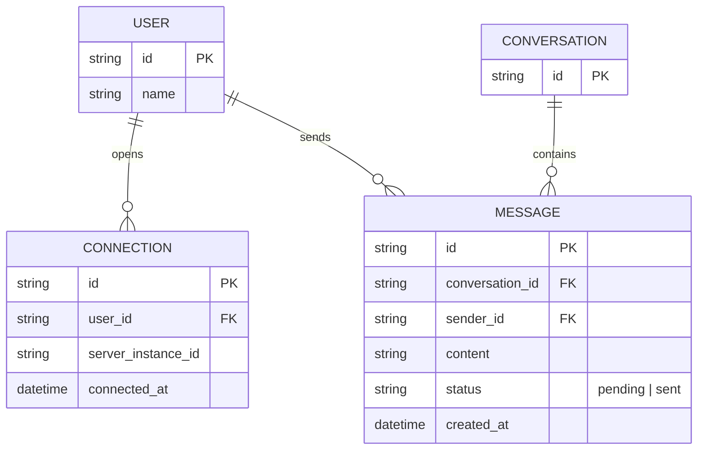

# Base ERD — Chat server real-time trước khi có graceful shutdown

Đây là **base**: mô hình dữ liệu suy luận từ ngữ cảnh đề bài, thể hiện trạng thái hệ thống **trước khi** chat server biết xử lý shutdown an toàn. Đề bài nói tới backend giữ kết nối WebSocket cho hàng chục nghìn user, mỗi kết nối gắn với 1 session hội thoại — nên base chỉ cần đủ: user, cuộc hội thoại, tin nhắn, và kết nối WebSocket hiện tại của user. Tin nhắn chưa gửi/chưa ACK chỉ tồn tại trong bộ nhớ của instance đang giữ kết nối, không có nơi lưu bền vững nào khác — đây chính là lỗ hổng mà enhance sẽ vá. Chưa có trạng thái draining, chưa có close code phân biệt, chưa có theo dõi typing/call, chưa có kế hoạch giới hạn % reconnect đồng thời — tất cả là phần enhance.

Ghi chú: `MESSAGE.status=pending` (đã tạo nhưng chưa gửi được qua WebSocket, hoặc đã gửi nhưng chưa nhận ACK từ client) chỉ được theo dõi trong bộ nhớ tiến trình của `server_instance_id` đang giữ `CONNECTION`, không có bảng/queue bền vững nào lưu lại phần này ở base.
