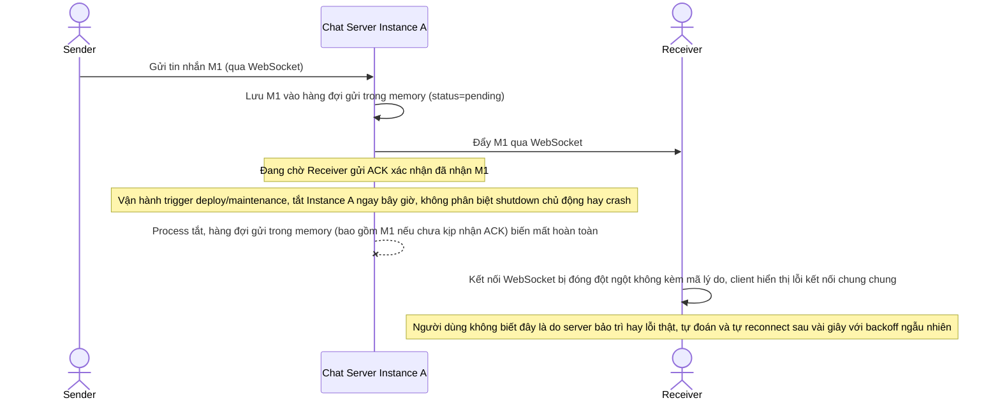

# Base sequence — Send message (chỉ giữ trong memory, mất khi instance tắt)

Đây là **base**, flow "Gửi tin nhắn qua WebSocket" ở trạng thái hiện tại — tin nhắn đang chờ gửi/chờ ACK chỉ tồn tại trong bộ nhớ của instance đang giữ kết nối, và khi instance tắt (không phân biệt lý do), kết nối bị đóng đột ngột không kèm mã lý do rõ ràng. Flow này liên quan mật thiết tới enhance vì toàn bộ yêu cầu của đề bài đều nhằm vá đúng những lỗ hổng này.

