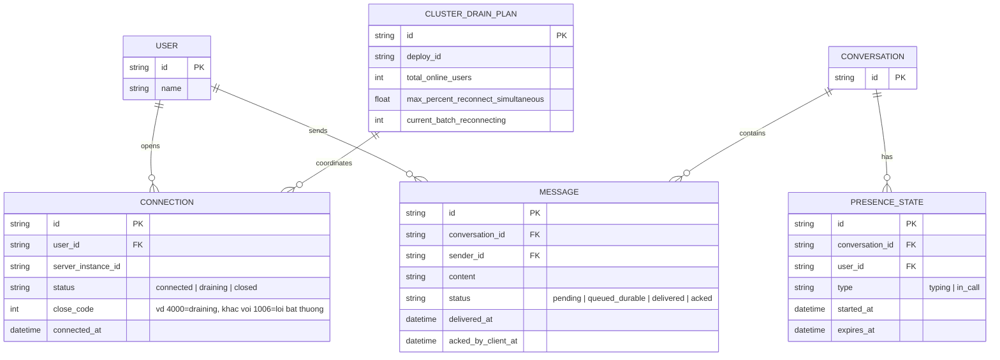

# Enhance ERD — Thêm hàng đợi bền vững, presence có TTL, kế hoạch giới hạn reconnect

Đây là **enhance**, mô hình dữ liệu sau khi áp toàn bộ đề bài lên base. So với base, các thay đổi:
- `MESSAGE` có thêm trạng thái `queued_durable` và cột `delivered_at`/`acked_by_client_at` — tin nhắn chưa được client ACK nay được ghi vào store bền vững thay vì chỉ giữ trong memory, và server theo dõi được đã gửi/đã ACK để tránh gửi trùng khi reconnect — đáp ứng yêu cầu 1 và yêu cầu 3.
- `CONNECTION` có thêm trạng thái `draining` và cột `close_code` — đáp ứng yêu cầu 2 (mã lý do riêng cho "server draining").
- Entity mới `PRESENCE_STATE` — đại diện trạng thái tạm thời như đang gõ hoặc đang trong cuộc gọi, có `expires_at` để không bao giờ treo vĩnh viễn — đáp ứng yêu cầu 4.
- Entity mới `CLUSTER_DRAIN_PLAN` — giới hạn tổng số kết nối bị buộc reconnect đồng thời không vượt quá X% tổng số user online — đáp ứng yêu cầu 5.

