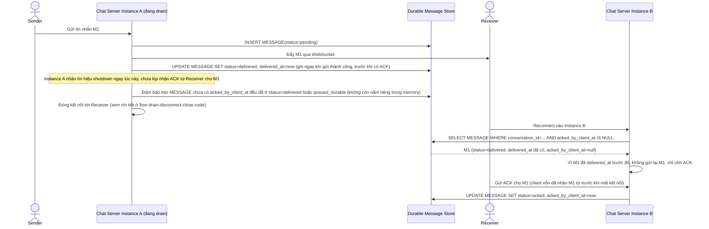

# Enhance sequence — Send message (chuyển giao hàng đợi bền vững, không gửi trùng khi reconnect)

Đây là **enhance** của flow `send-message` đã có ở base, đáp ứng **yêu cầu 1 và yêu cầu 3** của đề bài. So với base: tin nhắn chưa được ACK tại thời điểm shutdown được ghi vào store bền vững (`status=queued_durable`) thay vì chỉ giữ trong memory, để instance khác tiếp tục gửi. Song song đó, mỗi tin nhắn có `delivered_at` được ghi lại ngay khi gửi thành công, nên nếu server bị ngắt giữa lúc gửi ACK, instance mới khi reconnect biết tin nhắn đã delivered và không gửi lại trùng.

