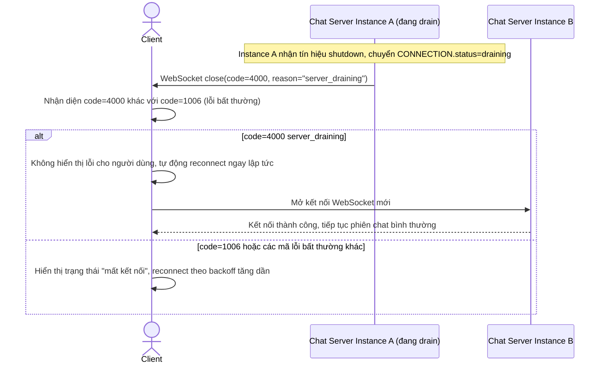

# Enhance sequence — Ngắt kết nối để drain kèm close code riêng biệt

Đây là flow **enhance** hoàn toàn mới so với base, đáp ứng **yêu cầu 2** của đề bài: khi ngắt kết nối WebSocket để drain, server gửi kèm close code riêng cho "server draining" (ví dụ 4000), khác với close code lỗi bất thường (ví dụ 1006), để client phân biệt và tự reconnect ngay thay vì hiển thị lỗi gây hoang mang.

