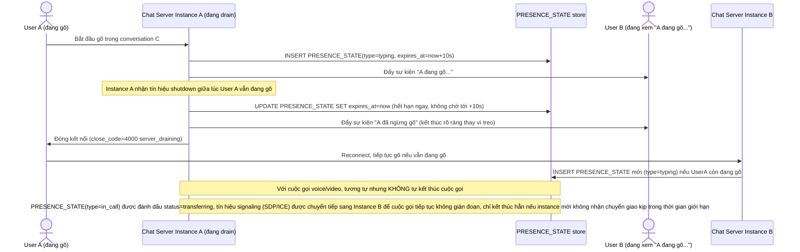

# Enhance sequence — Chuyển giao/kết thúc rõ ràng typing indicator và cuộc gọi khi drain

Đây là flow **enhance** hoàn toàn mới so với base, đáp ứng **yêu cầu 4** của đề bài: khi server drain lúc user đang gõ hoặc đang trong cuộc gọi voice/video, các `PRESENCE_STATE` này phải được chuyển giao hoặc kết thúc rõ ràng, không để lại trạng thái "đang gõ" treo vĩnh viễn ở phía người nhận.

