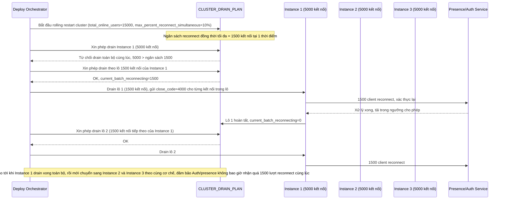

# Enhance sequence — Rolling restart toàn cluster giới hạn % kết nối reconnect đồng thời

Đây là flow **enhance** hoàn toàn mới so với base, đáp ứng **yêu cầu 5** của đề bài: rolling restart toàn cluster chat server sao cho tại mọi thời điểm, tổng số kết nối bị buộc reconnect đồng thời không vượt quá X% tổng số user online, tránh spike tải lên hệ thống presence/auth.

