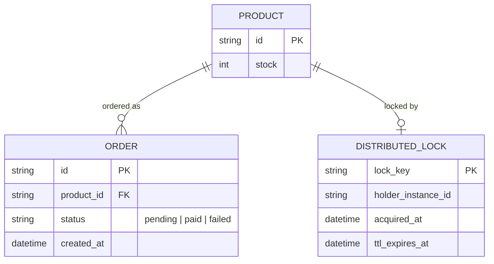

# Base ERD — Checkout service trước khi có graceful shutdown

Đây là **base**: mô hình dữ liệu suy luận từ ngữ cảnh đề bài, thể hiện trạng thái hệ thống **trước khi** instance biết xử lý shutdown an toàn. Đề bài nói checkout tạo order, trừ tồn kho, gọi cổng thanh toán, và có nhắc tới việc instance có thể đang giữ distributed lock tồn kho — nên base cần đủ: sản phẩm/tồn kho, đơn hàng, distributed lock dùng khi trừ tồn kho. Chưa có khái niệm readiness/draining, chưa có grace period, chưa có chiến lược xử lý đơn nửa vời, chưa có kịch bản test toàn trình — tất cả là phần enhance.

