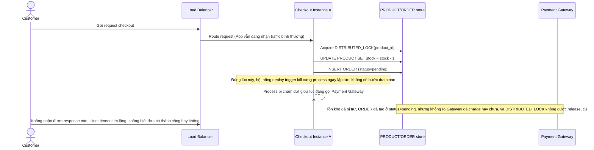

# Base sequence — Checkout (kill cứng khi deploy, lock treo, đơn nửa vời)

Đây là **base**, flow "Checkout: trừ tồn kho, tạo order, gọi cổng thanh toán" ở trạng thái hiện tại — deploy đơn giản kill cứng instance ngay khi có bản mới, không có bước báo readiness=false, không có grace period, không có xử lý khi đang giữ lock. Flow này liên quan mật thiết tới enhance vì toàn bộ 5 yêu cầu của đề bài đều nhằm sửa đúng khoảng hở này.

