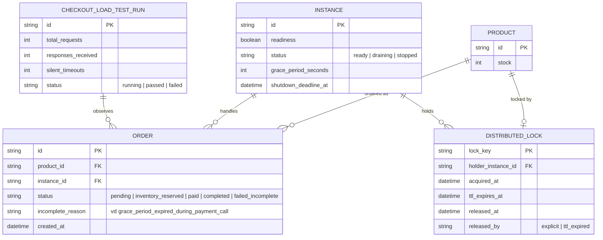

# Enhance ERD — Thêm readiness/draining, chiến lược đơn nửa vời, kịch bản test toàn trình

Đây là **enhance**, mô hình dữ liệu sau khi áp toàn bộ đề bài lên base. So với base, các thay đổi:
- Entity mới `INSTANCE` — đại diện 1 instance của checkout service, có `readiness`, `status` (ready/draining/stopped), `grace_period_seconds`, `shutdown_deadline_at` — đáp ứng yêu cầu 1, 2 và 4 (báo readiness=false ngay, nhưng vẫn trả lời health check probe trong lúc drain).
- `ORDER` có thêm trạng thái `inventory_reserved` và `failed_incomplete` cùng cột `incomplete_reason` — đáp ứng yêu cầu 2 (khi hết grace period mà giao dịch chưa xong, ghi lại state rõ ràng thay vì để đơn "nửa vời" không rõ nguyên nhân).
- `DISTRIBUTED_LOCK` có thêm cột `released_at` và `released_by` — đáp ứng yêu cầu 3 (đảm bảo lock được release hoặc tự hết TTL, không treo vĩnh viễn).
- Entity mới `CHECKOUT_LOAD_TEST_RUN` — ghi nhận kết quả bài test toàn trình gửi 100 request đồng thời rồi trigger shutdown giữa chừng — đáp ứng yêu cầu 5.

