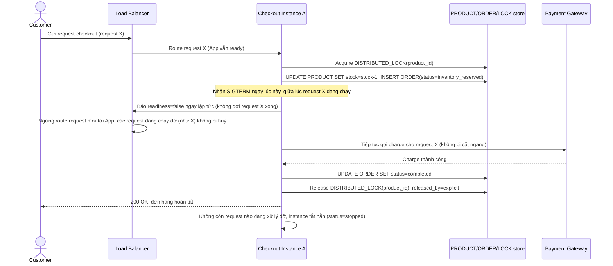

# Enhance sequence — Checkout (readiness=false ngay lập tức, hoàn tất giao dịch đang chạy, release lock)

Đây là **enhance** của flow `checkout` đã có ở base, đáp ứng **yêu cầu 1 và yêu cầu 3** của đề bài. So với base: khi nhận SIGTERM, instance báo `readiness=false` ngay lập tức để load balancer ngừng gửi request mới, nhưng vẫn tiếp tục xử lý request đang chạy cho tới khi xong; sau khi giao dịch hoàn tất, `DISTRIBUTED_LOCK` được release tường minh thay vì để treo.

