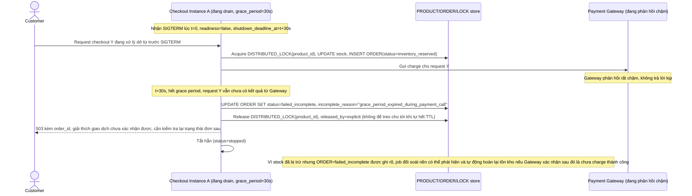

# Enhance sequence — Hết grace period giữa lúc giao dịch chưa xong, ghi state rõ ràng thay vì kill cứng

Đây là flow **enhance** hoàn toàn mới so với base, đáp ứng **yêu cầu 2 và phần còn lại của yêu cầu 3** của đề bài: định nghĩa grace period tối đa (30 giây) — nếu giao dịch checkout chưa xong khi hết grace period, hệ thống ghi lại state rõ ràng (`failed_incomplete` kèm lý do) thay vì kill cứng để lại đơn nửa vời, đồng thời đảm bảo `DISTRIBUTED_LOCK` được release tường minh trước khi tắt hẳn.

