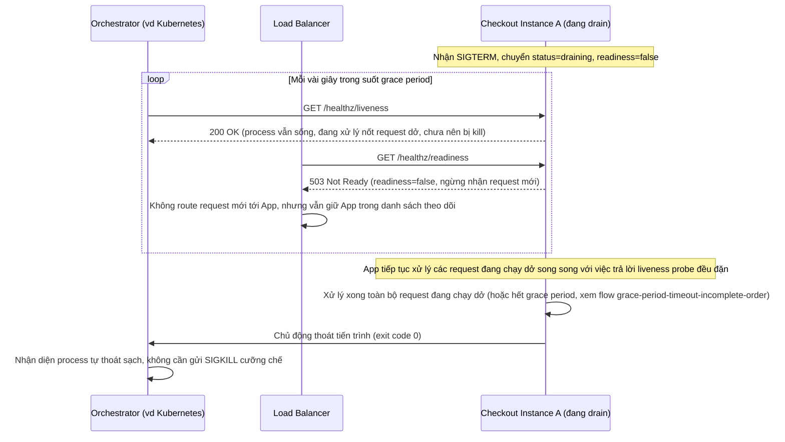

# Enhance sequence — Health check probe vẫn được trả lời trong lúc drain

Đây là flow **enhance** hoàn toàn mới so với base, đáp ứng **yêu cầu 4** của đề bài: trong lúc drain, instance không nhận thêm request mới (health check báo not-ready) nhưng vẫn phải trả lời được health check probe, để hạ tầng (Kubernetes/orchestrator) không kill instance ngay lập tức trước khi drain xong.

