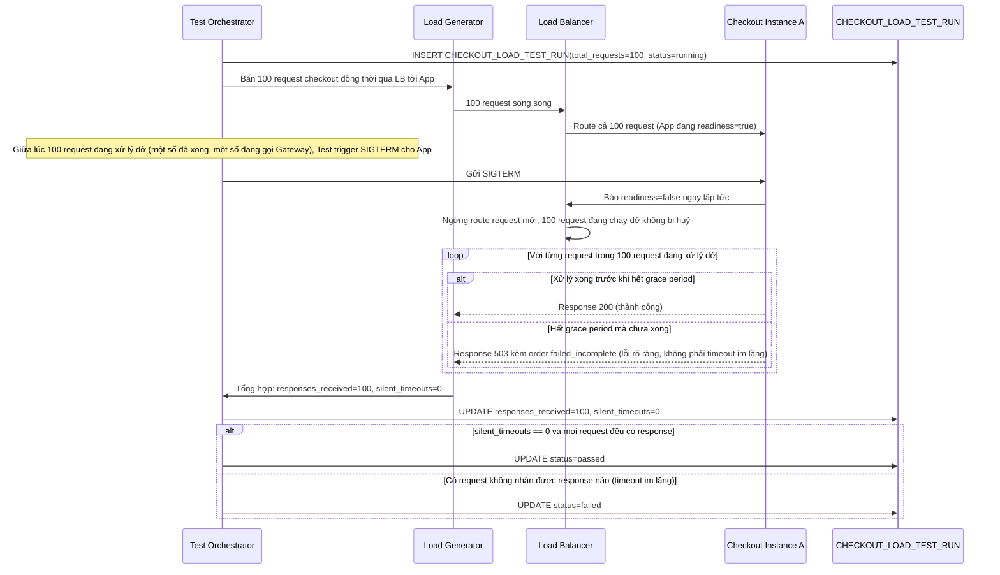

# Enhance sequence — Test toàn trình 100 request đồng thời rồi trigger shutdown giữa chừng

Đây là flow **enhance** hoàn toàn mới so với base, đáp ứng **yêu cầu 5** của đề bài: gửi 100 request checkout đồng thời rồi trigger shutdown giữa chừng, verify không có request nào bị mất kết nối nửa đường — mỗi request phải nhận được response (kể cả response lỗi rõ ràng như 503/failed_incomplete), không bao giờ là timeout im lặng.

