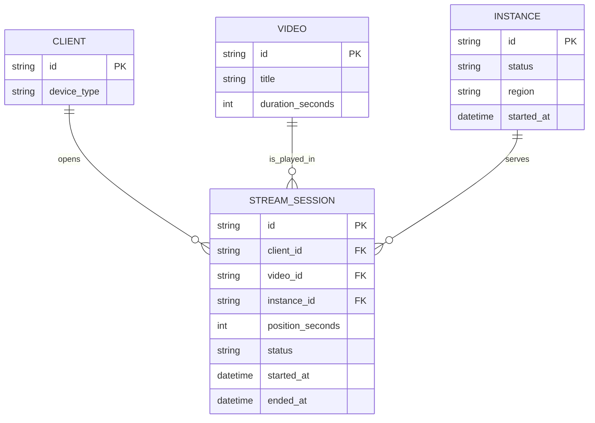

# ERD - Base (trước khi có graceful shutdown cho streaming)

Đây là **base**: mô hình dữ liệu tối thiểu của một server phát video theo yêu cầu, phục vụ nhiều client qua kết nối HTTP dài. Chỉ giữ lại các entity cần để hiểu vì sao shutdown là vấn đề: một `Instance` đang giữ nhiều `StreamSession` sống lâu, mỗi session gắn với một `Video` có `duration_seconds` xác định (căn cứ để enhance sau này tính phân vị thời lượng và ước tính thời gian còn lại).

