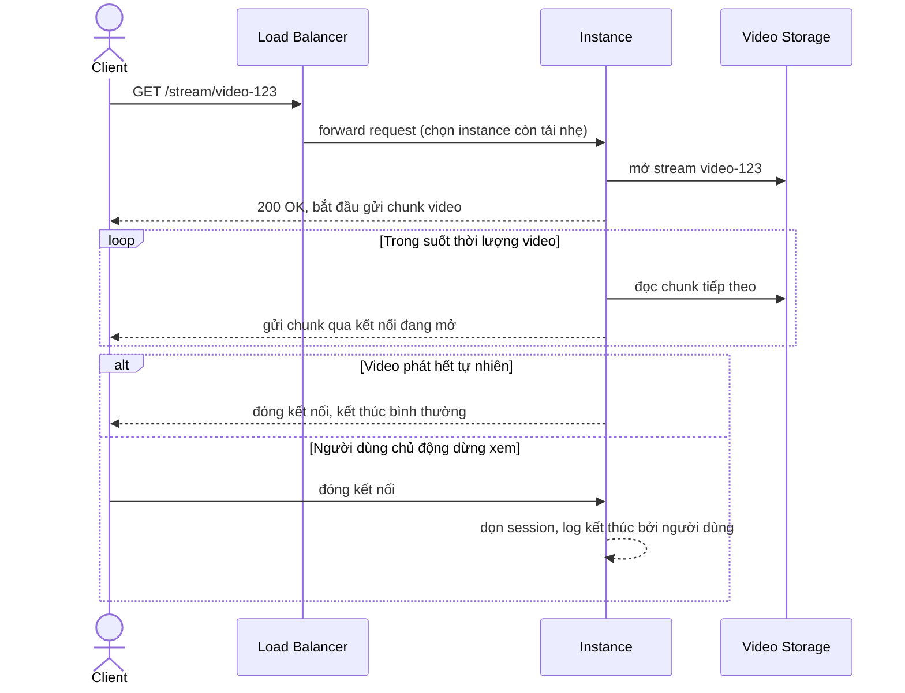

# Sequence - Base - Flow "playback"

Đây là **base**: flow phát video bình thường, khi chưa có bất kỳ cơ chế shutdown nào. Flow này được chọn làm nền vì nó xác lập bản chất của kết nối streaming - một request duy nhất nhưng giữ mở rất lâu, đọc liên tục nhiều chunk - chính là lý do khiến shutdown thông thường (đóng kết nối sau vài chục giây) không áp dụng được.

