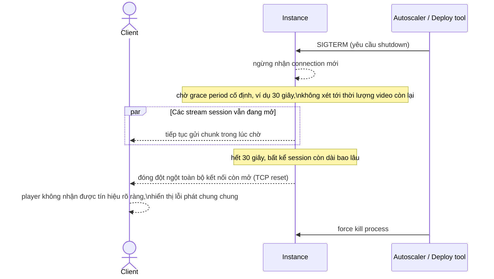

# Sequence - Base - Flow "instance-shutdown"

Đây là **base**: cách một instance xử lý tín hiệu shutdown theo kiểu request ngắn thông thường (fixed grace period ngắn, hết giờ là cắt hết). Flow này được chọn vì chính nó là điểm bất hợp lý mà đề bài yêu cầu sửa - áp dụng lên các kết nối streaming dài sẽ cắt ngang video đang phát và khiến player báo lỗi im lặng.

