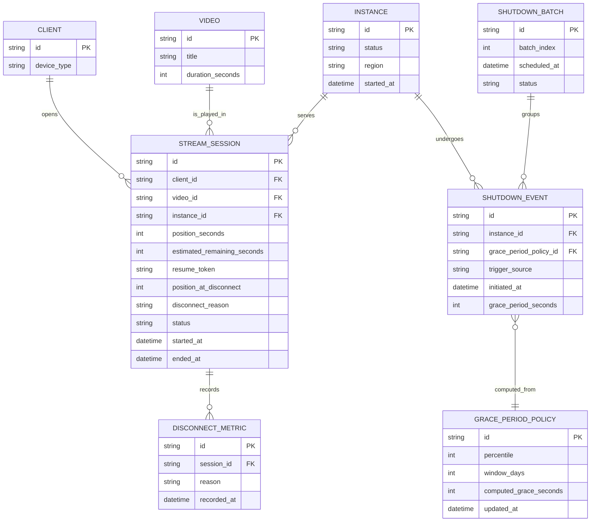

# ERD - Enhance (graceful shutdown cho streaming server)

Đây là **enhance**: mô hình dữ liệu sau khi thêm cơ chế shutdown chuyên biệt cho kết nối streaming dài. So với base, các thay đổi là:

- `STREAM_SESSION` có thêm `estimated_remaining_seconds` (ước tính thời lượng còn lại, dùng để phân loại - yêu cầu 1), `resume_token` và `position_at_disconnect` (để client reconnect đúng vị trí - yêu cầu 1, 3), và `disconnect_reason` (`completed_naturally` / `user_stop` / `shutdown_forced` - yêu cầu 5).
- `GRACE_PERIOD_POLICY` (mới): lưu percentile cấu hình (ví dụ p95) và giá trị grace period tính được từ phân phối `duration_seconds` thực tế của video đang phát - yêu cầu 2.
- `SHUTDOWN_EVENT` (mới): 1 lần shutdown của 1 instance, tham chiếu tới policy đã dùng để tính grace period.
- `SHUTDOWN_BATCH` (mới): gom nhiều `SHUTDOWN_EVENT` xảy ra gần như đồng thời (autoscale scale-in loạt lớn) thành các đợt (batch) có `scheduled_at` giãn cách nhau - yêu cầu 4.
- `DISCONNECT_METRIC` (mới): 1 bản ghi mỗi khi session kết thúc, dùng để tách riêng tỷ lệ ngắt do shutdown khỏi drop-off thông thường - yêu cầu 5.

