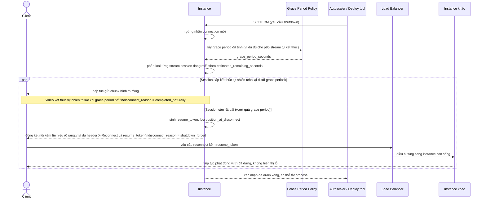

# Sequence - Enhance - Flow "instance-shutdown"

Đây là **enhance**, cùng flow `instance-shutdown` như ở base nhưng thay đổi hoàn toàn cách xử lý, đáp ứng yêu cầu 1, 2 và 3 trong đề bài: thay vì một grace period cố định ngắn cắt hết mọi kết nối, instance tính grace period theo phân vị thời lượng video (yêu cầu 2), phân loại từng session theo thời lượng còn lại (yêu cầu 1), và khi buộc phải ngắt thì gửi tín hiệu rõ ràng để player biết cần reconnect đúng vị trí (yêu cầu 3), thay vì để kết nối treo hoặc timeout im lặng như ở base.

