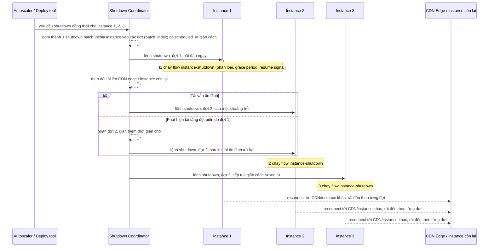

# Sequence - Enhance - Flow "coordinated-shutdown"

Đây là **enhance**, flow hoàn toàn mới so với base, đáp ứng yêu cầu 4 trong đề bài: khi autoscale scale-in loạt lớn xảy ra gần như đồng thời với deploy, nhiều instance nhận tín hiệu shutdown cùng lúc. Nếu mỗi instance tự xử lý grace period độc lập như ở flow "instance-shutdown", toàn bộ client bị buộc reconnect có thể dồn vào cùng một thời điểm, gây spike tải lên các instance còn lại và CDN edge. Flow này thêm một coordinator đứng giữa để giãn cách các đợt shutdown.

