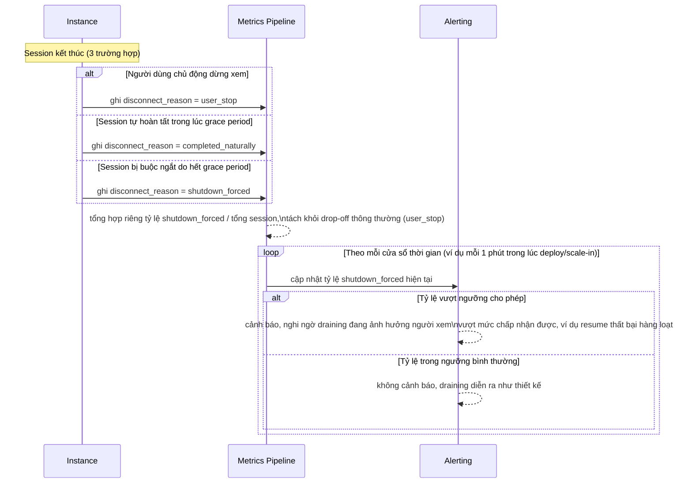

# Sequence - Enhance - Flow "shutdown-metrics"

Đây là **enhance**, flow hoàn toàn mới so với base, đáp ứng yêu cầu 5 trong đề bài: mỗi khi một stream session kết thúc, hệ thống phải ghi nhận rõ lý do kết thúc (người dùng chủ động dừng, hoàn tất tự nhiên trong lúc drain, hay bị buộc ngắt do shutdown) để tách riêng được tỷ lệ ảnh hưởng thực sự của draining, thay vì gộp chung vào số liệu drop-off thông thường.

