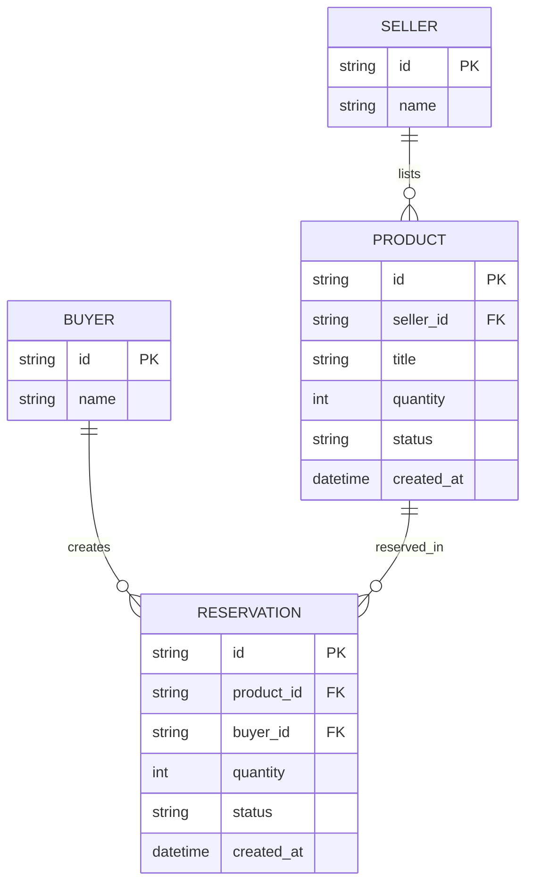

# ERD - Base (trước khi xử lý concurrency cho reservation C2C)

Đây là **base**: mô hình dữ liệu tối thiểu của một marketplace C2C, nơi seller đăng sản phẩm với số lượng, buyer đặt mua để giữ chỗ. Chỉ giữ `Seller`, `Buyer`, `Product`, `Reservation` - đủ để thấy vấn đề: `Product.quantity` là một con số đơn giản, còn `Reservation` chưa có TTL rõ ràng hay cơ chế atomic, chưa có audit log - đúng những gì enhance sẽ bổ sung.

