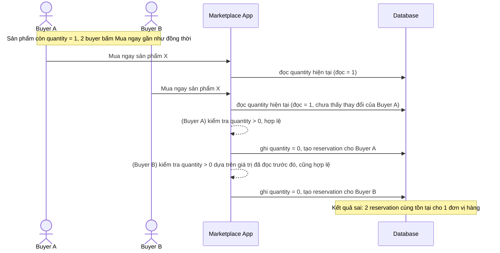

# Sequence - Base - Flow "create-reservation"

Đây là **base**: cách buyer đặt mua (giữ reservation) trước khi có xử lý concurrency, dùng read-modify-write đơn giản trên `quantity`. Flow này được chọn vì nó chính là nơi race condition xảy ra khi enhance yêu cầu 2 buyer bấm "Mua ngay" gần như đồng thời cho sản phẩm chỉ còn 1 số lượng (yêu cầu 3).

