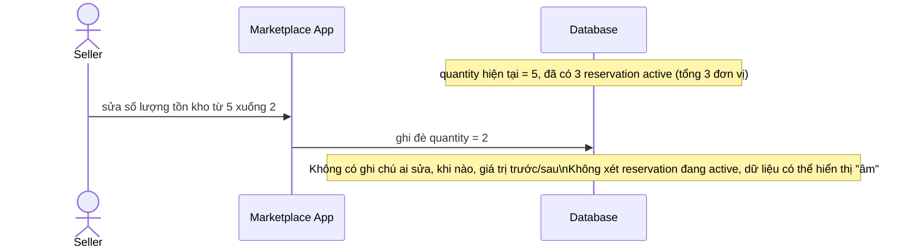

# Sequence - Base - Flow "update-quantity"

Đây là **base**: cách seller sửa số lượng tồn kho trước khi có quy tắc phối hợp với reservation đang tồn tại - đơn giản là ghi đè `quantity` mới, không xét tới các reservation đã giữ trước đó. Flow này được chọn vì nó là tiền đề cho yêu cầu 1 (seller sửa số lượng khi buyer đang giữ reservation) và yêu cầu 5 (chưa có audit log nào ghi lại thay đổi).

