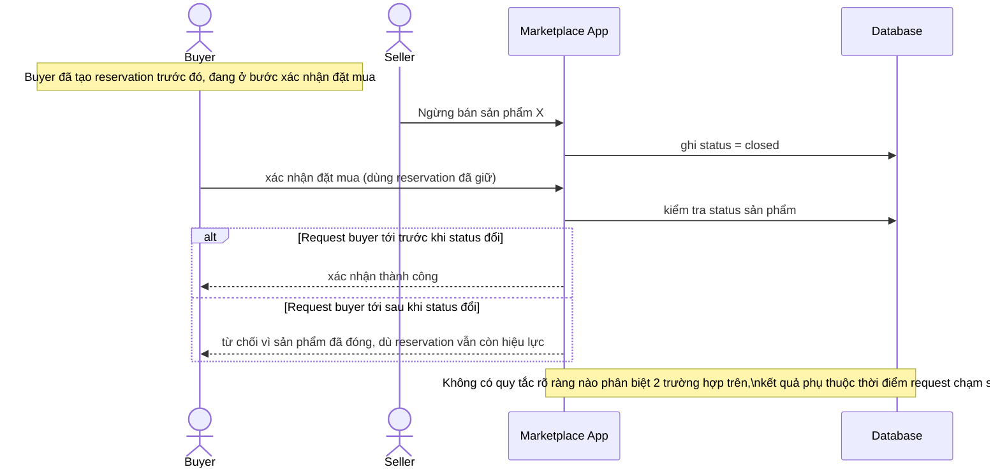

# Sequence - Base - Flow "close-product"

Đây là **base**: cách seller ngừng bán một sản phẩm trước khi có quy định ranh giới thời điểm rõ ràng với buyer đang xác nhận đặt mua. Flow này được chọn vì nó là tiền đề cho yêu cầu 2 - đề bài yêu cầu định nghĩa rõ "trước/sau" thời điểm đóng sản phẩm, còn ở base thì hành vi mơ hồ, tùy thời điểm request buyer chạm tới app trước hay sau khi cờ status đổi.

