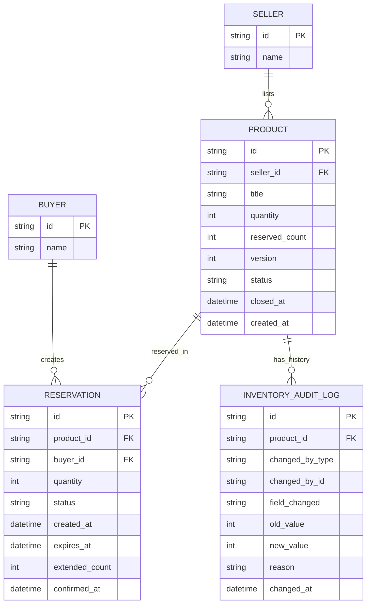

# ERD - Enhance (reservation an toàn cho concurrency C2C)

Đây là **enhance**: mô hình dữ liệu sau khi thêm cơ chế xử lý concurrency giữa seller và buyer. So với base, các thay đổi là:

- `PRODUCT` có thêm `reserved_count` (tổng số lượng đang bị giữ bởi reservation active, tách khỏi `quantity` để không cần hủy reservation cũ khi seller giảm số lượng - yêu cầu 1), `version` (dùng cho update nguyên tử/optimistic lock trên tồn kho khả dụng - yêu cầu 3), và `closed_at` (mốc thời gian chính xác để phân biệt reservation "trước/sau" khi ngừng bán - yêu cầu 2).
- `RESERVATION` có thêm `expires_at`, `extended_count` (TTL ngắn và cơ chế gia hạn khi buyer/seller đang chat - yêu cầu 4), và `status` mở rộng (`active` / `confirmed` / `expired` / `cancelled`) để phân biệt trạng thái tại thời điểm reservation được tạo.
- `INVENTORY_AUDIT_LOG` (mới): 1 bản ghi cho mỗi lần `quantity` hoặc `reserved_count` thay đổi, lưu ai sửa, khi nào, giá trị trước/sau - phục vụ tra soát tranh chấp (yêu cầu 5).

