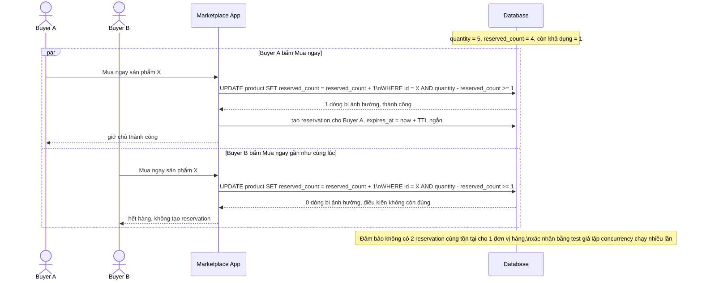

# Sequence - Enhance - Flow "create-reservation"

Đây là **enhance**, cùng flow `create-reservation` như ở base nhưng thay update read-modify-write bằng update nguyên tử có điều kiện trên `reserved_count`, đáp ứng yêu cầu 3: 2 buyer bấm "Mua ngay" gần như đồng thời cho sản phẩm chỉ còn 1 số lượng khả dụng thì chỉ 1 người giữ được reservation. Flow cũng gán `expires_at` theo TTL ngắn của C2C ngay khi tạo, chuẩn bị cho yêu cầu 4.

