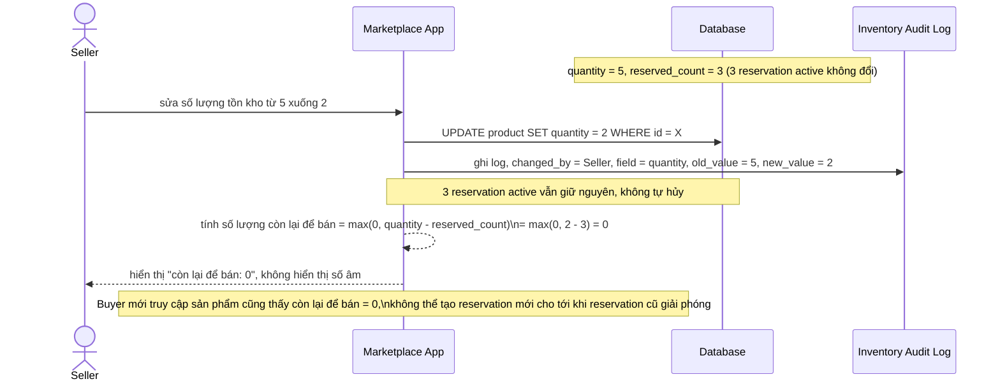

# Sequence - Enhance - Flow "update-quantity"

Đây là **enhance**, cùng flow `update-quantity` như ở base nhưng thay đổi hành vi cốt lõi, đáp ứng yêu cầu 1 và yêu cầu 5: khi seller sửa `quantity` từ 5 xuống 2 lúc đang có 3 reservation active (tổng 3 đơn vị), các reservation cũ vẫn hợp lệ - không bị hủy tự động; chỉ số lượng còn lại để bán mới (`quantity - reserved_count`) bị giới hạn và được kẹp về 0 thay vì hiển thị số âm. Mọi thay đổi đều ghi audit log.

