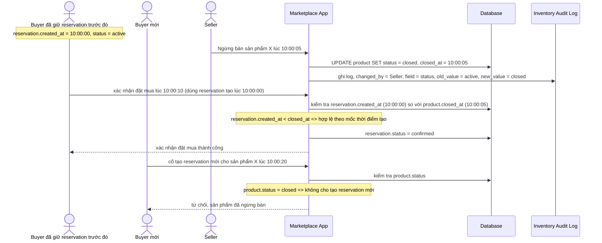

# Sequence - Enhance - Flow "close-product"

Đây là **enhance**, cùng flow `close-product` như ở base nhưng thay đổi hành vi cốt lõi, đáp ứng yêu cầu 2: ranh giới "trước/sau" được định nghĩa rõ bằng `reservation.created_at` so với `product.closed_at`, không phụ thuộc vào thời điểm request của buyer chạm tới server. Buyer đã giữ reservation hợp lệ trước mốc đóng vẫn được mua, buyer mới sau mốc đó không thể tạo reservation.

