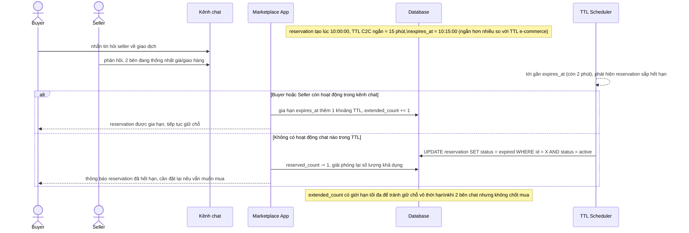

# Sequence - Enhance - Flow "reservation-ttl-extend"

Đây là **enhance**, flow hoàn toàn mới so với base, đáp ứng yêu cầu 4: reservation ở marketplace C2C có TTL ngắn hơn e-commerce chính thức (vì buyer/seller cần thời gian chat để thống nhất giao dịch), và có cơ chế gia hạn khi 2 bên vẫn đang trao đổi thay vì để reservation tự hết hạn giữa chừng.

