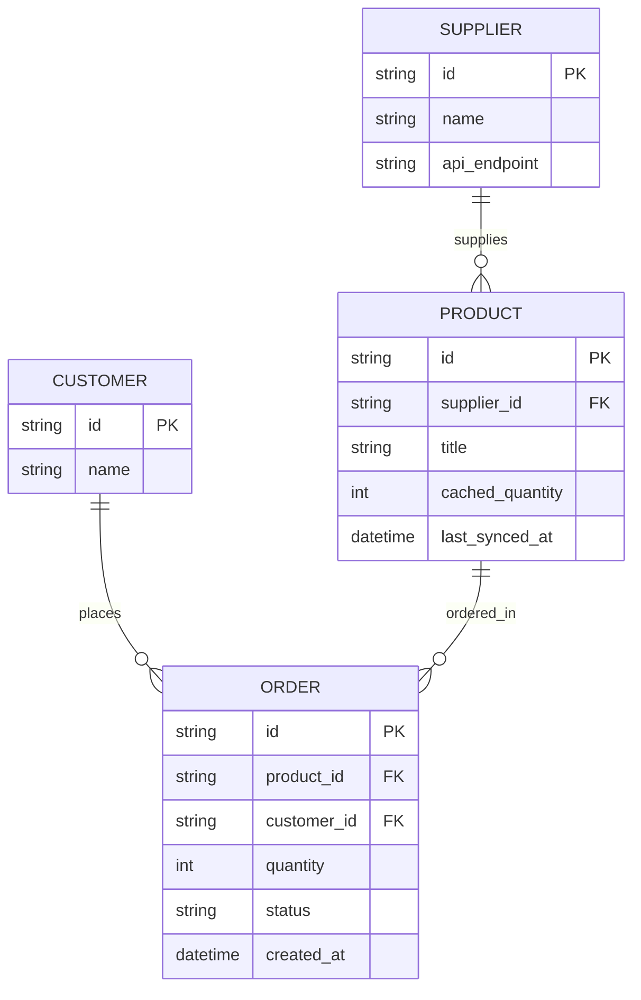

# ERD - Base (trước khi có xác nhận thật với nhà cung cấp)

Đây là **base**: mô hình dữ liệu tối thiểu của một sàn dropshipping, nơi tồn kho hiển thị là một cache đồng bộ định kỳ từ API nhà cung cấp, khách đặt mua dựa trên cache đó. Chỉ giữ `Supplier`, `Product` (mang `cached_quantity`), `Customer`, `Order` - đủ để thấy vấn đề gốc: đặt hàng chỉ dựa vào cache có thể lệch với tồn kho thật, và cache có thể bị đồng bộ đè mất thay đổi tạm thời.

