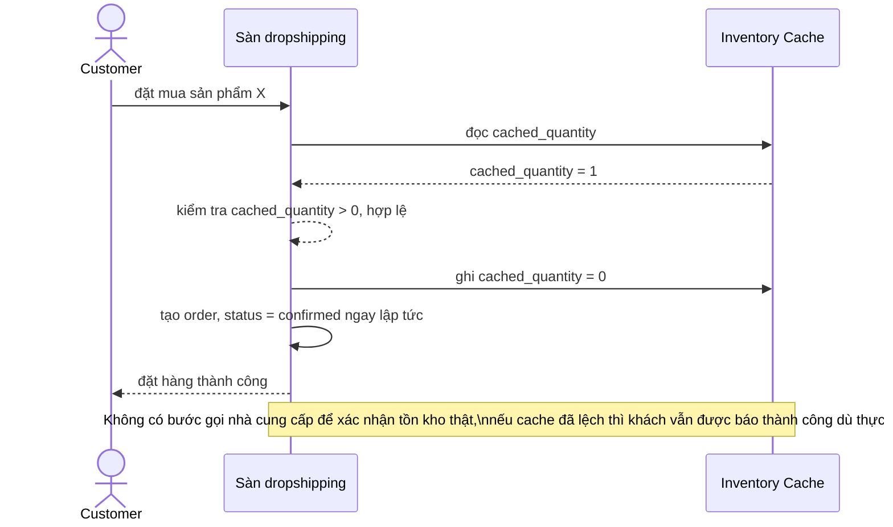

# Sequence - Base - Flow "place-order"

Đây là **base**: khách đặt mua chỉ dựa vào tồn kho cache nội bộ, không có bước xác nhận thật với nhà cung cấp trước khi chốt đơn. Flow này được chọn vì nó là hiện trạng mà enhance yêu cầu sửa: chưa trừ cache nguyên tử, chưa gọi API xác nhận, chưa có rollback khi nhà cung cấp thực tế đã hết hàng (yêu cầu 1).

