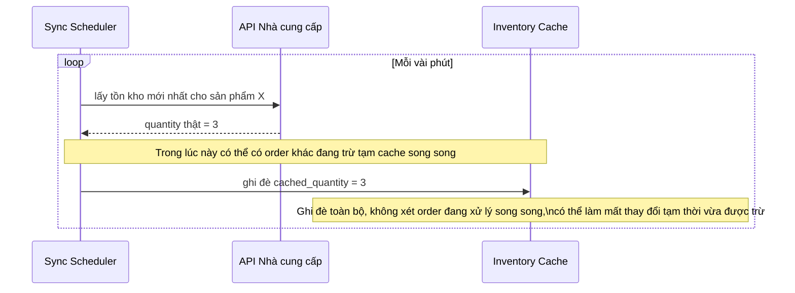

# Sequence - Base - Flow "inventory-sync"

Đây là **base**: đồng bộ tồn kho định kỳ từ nhà cung cấp về cache nội bộ bằng cách ghi đè trực tiếp giá trị mới nhất. Flow này được chọn vì nó là tiền đề cho yêu cầu 3 - ghi đè đơn giản như thế này sẽ xóa mất mọi thay đổi tạm thời (ví dụ order đang được xử lý song song) diễn ra trong lúc đồng bộ chạy.

