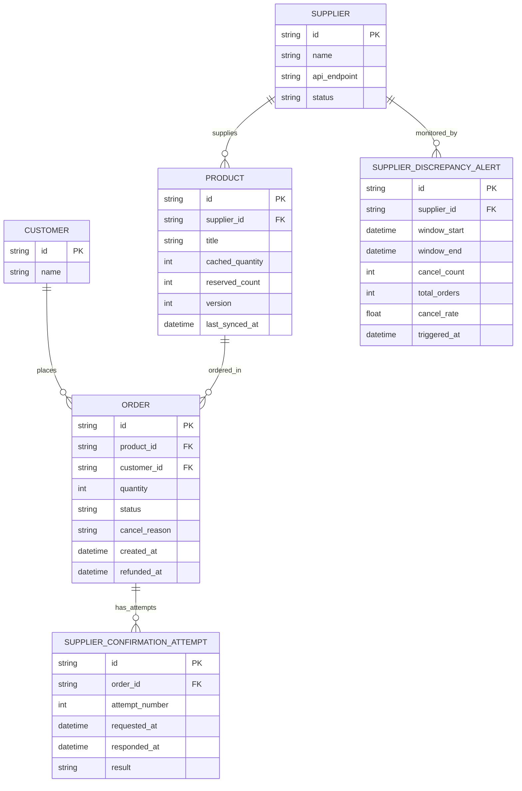

# ERD - Enhance (xác nhận thật với nhà cung cấp + xử lý lệch tồn kho)

Đây là **enhance**: mô hình dữ liệu sau khi thêm bước xác nhận thật với nhà cung cấp và các cơ chế xử lý lệch tồn kho. So với base, các thay đổi là:

- `PRODUCT` có thêm `reserved_count` (giữ tạm khi order đang chờ xác nhận, tách khỏi `cached_quantity` để sync không đè mất - yêu cầu 3) và `version` (dùng cho update nguyên tử khi trừ cache và khi merge sync - yêu cầu 1, 3).
- `ORDER` có thêm `status` mở rộng (`pending_confirmation` / `confirmed` / `cancelled_out_of_stock` / `cancelled_timeout`), `cancel_reason`, `refunded_at` - phản ánh kết quả xác nhận thật với nhà cung cấp (yêu cầu 1, 2, 4).
- `SUPPLIER_CONFIRMATION_ATTEMPT` (mới): mỗi lần gọi API xác nhận đặt hàng thật, gồm `attempt_number`, `requested_at`, `responded_at`, `result` - phục vụ chính sách retry/timeout (yêu cầu 4).
- `SUPPLIER_DISCREPANCY_ALERT` (mới): tổng hợp tỷ lệ hủy đơn do lệch tồn kho theo từng nhà cung cấp trong 1 khung thời gian, kèm mốc `triggered_at` khi vượt ngưỡng (yêu cầu 5). `SUPPLIER` có thêm `status` (`active` / `hidden`) để team vận hành tạm ẩn sản phẩm khi cảnh báo xảy ra.

