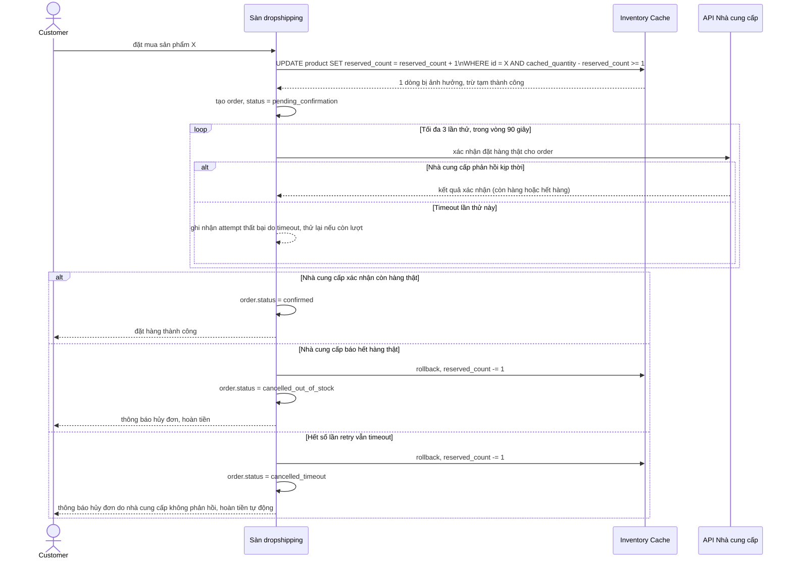

# Sequence - Enhance - Flow "place-order"

Đây là **enhance**, cùng flow `place-order` như ở base nhưng nay gồm 3 bước bắt buộc theo yêu cầu 1: (1) trừ tạm cache nguyên tử, (2) gọi API xác nhận đặt hàng thật với nhà cung cấp, (3) rollback cache và hoàn tiền nếu nhà cung cấp báo hết hàng thật. Bước gọi nhà cung cấp cũng áp dụng chính sách retry/timeout theo yêu cầu 4: tối đa 3 lần thử trong 90 giây, quá đó coi là thất bại và tự động hoàn tiền, tránh đơn ở trạng thái "đang xử lý" vô thời hạn.

