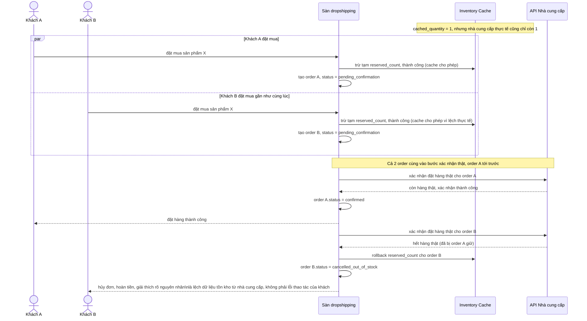

# Sequence - Enhance - Flow "concurrent-order-conflict"

Đây là **enhance**, flow hoàn toàn mới so với base, mô tả chi tiết kịch bản race mà yêu cầu 2 nêu ra: cache nội bộ báo còn 1, 2 khách cùng đặt mua nên cả 2 đều trừ cache thành công (vì cache đã lệch so với nhà cung cấp chỉ còn 1 thật). Quy tắc xử lý: request xác nhận với nhà cung cấp nào đến trước được ưu tiên giữ, request sau khi biết nhà cung cấp báo hết phải tự động hủy, hoàn tiền và giải thích rõ nguyên nhân cho khách thứ 2.

