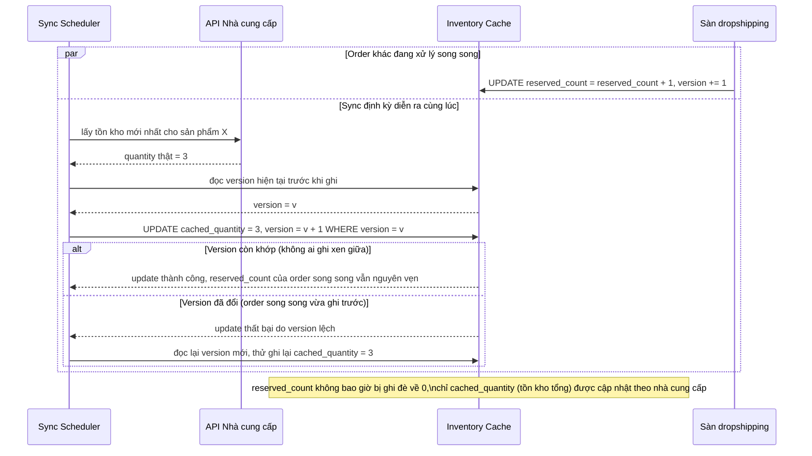

# Sequence - Enhance - Flow "inventory-sync"

Đây là **enhance**, cùng flow `inventory-sync` như ở base nhưng thay ghi đè trực tiếp bằng update nguyên tử có điều kiện, đáp ứng yêu cầu 3: đồng bộ tồn kho từ nhà cung cấp không được ghi đè mất các thay đổi tạm thời (`reserved_count`) do order đang xử lý song song tạo ra trong lúc đồng bộ diễn ra.

