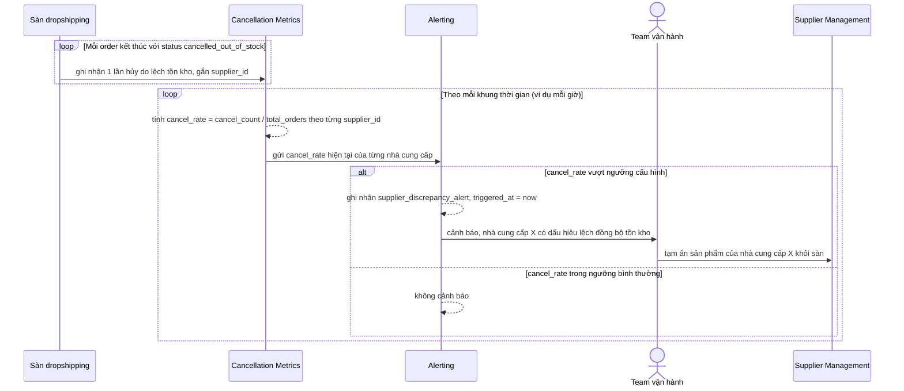

# Sequence - Enhance - Flow "discrepancy-alert"

Đây là **enhance**, flow hoàn toàn mới so với base, đáp ứng yêu cầu 5: theo dõi tỷ lệ hủy đơn do lệch tồn kho (`cancelled_out_of_stock`) theo từng nhà cung cấp, cảnh báo khi vượt ngưỡng để team vận hành biết đồng bộ dữ liệu với nhà cung cấp đó đang có vấn đề và có thể tạm ẩn sản phẩm của nhà cung cấp khỏi sàn.

