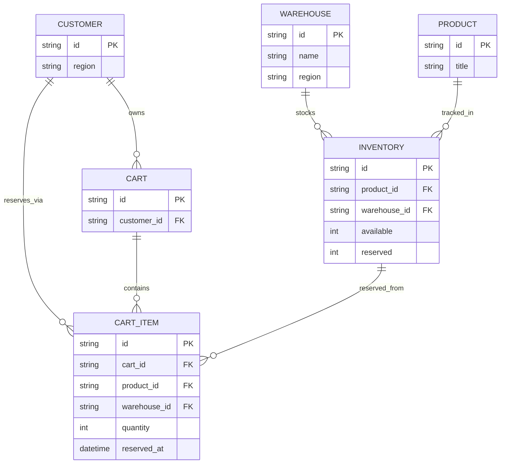

# ERD - Base (trước khi có reservation atomic nhiều kho)

Đây là **base**: mô hình dữ liệu của sàn e-commerce nhiều kho, nơi tồn kho đã có khái niệm "soft reserve 15 phút" nhưng được cài đặt đơn giản - `reserved` chỉ là một cột số nguyên tăng/giảm trực tiếp trên `Inventory`, không có bảng reservation riêng để truy ngược ai đang giữ, giữ từ khi nào, hết hạn lúc nào. `CartItem` chỉ lưu `reserved_at` để một cron job dựa vào đó blind-decrement `reserved` sau 15 phút.

