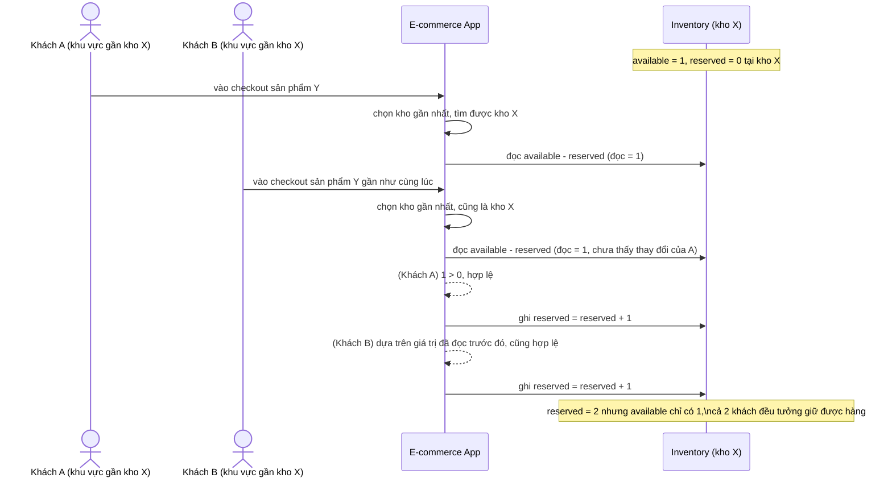

# Sequence - Base - Flow "checkout-reserve"

Đây là **base**: khách vào bước checkout, hệ thống chọn kho gần nhất rồi giữ tồn kho bằng cách đọc số dư trước, kiểm tra, rồi ghi sau (2 bước tách rời, không atomic). Flow này được chọn vì nó chính là nguyên nhân của race mà yêu cầu 1 mô tả: 2 khách ở 2 khu vực khác nhau cùng checkout sản phẩm chỉ còn 1 đơn vị ở kho gần cả hai.

