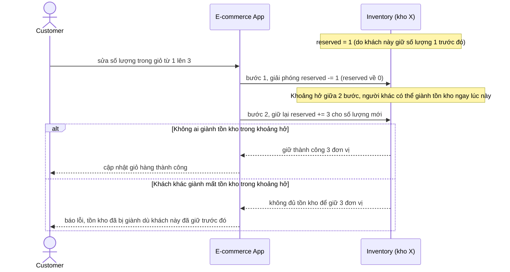

# Sequence - Base - Flow "update-cart-quantity"

Đây là **base**: khi khách sửa số lượng trong giỏ hàng lúc đang giữ reservation, hệ thống hủy phần đã giữ rồi giữ lại từ đầu theo số lượng mới - 2 bước tách rời. Flow này được chọn vì đây chính là cách làm mà yêu cầu 4 chỉ ra là có vấn đề: giữa lúc hủy và giữ lại, tồn kho đã giữ có thể bị người khác giành mất.

