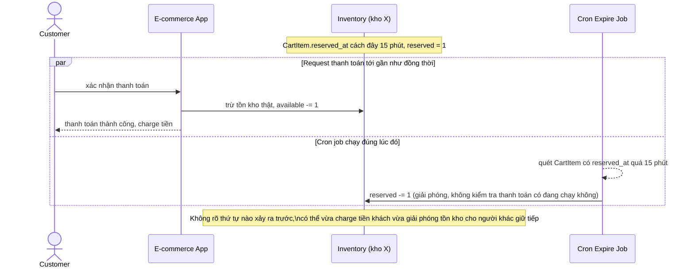

# Sequence - Base - Flow "expire-reservation"

Đây là **base**: cron job giải phóng reservation hết hạn bằng cách blind-decrement cột `reserved`, dựa trên `reserved_at` của `CartItem`, không kiểm tra gì thêm. Flow này được chọn vì nó là tiền đề cho yêu cầu 3 - khi job này chạy gần như đồng thời với request thanh toán, không có cơ chế nào đảm bảo thứ tự đúng, có thể vừa charge tiền vừa đã giải phóng tồn kho cho người khác.

