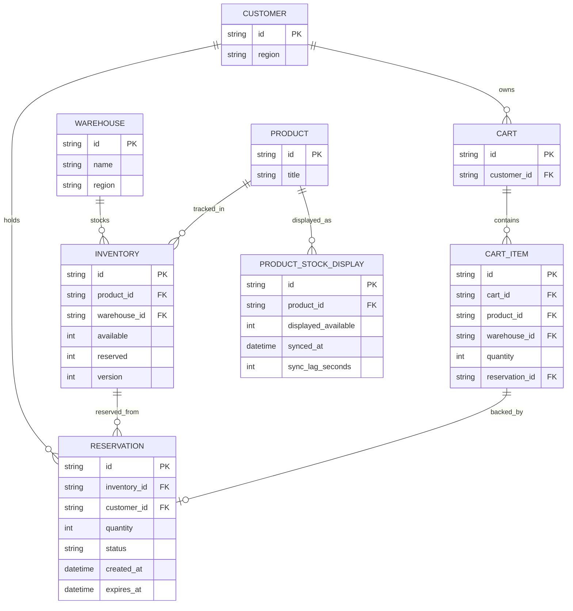

# ERD - Enhance (reservation atomic + bảng trạng thái riêng)

Đây là **enhance**: mô hình dữ liệu sau khi tách reservation ra khỏi cột `reserved` đơn thuần. So với base, các thay đổi là:

- `RESERVATION` (mới, thay cho việc chỉ tăng/giảm `Inventory.reserved`): mỗi lần giữ hàng là 1 dòng riêng với `status` (`active` / `expired` / `consumed`), `created_at`, `expires_at` - truy ngược được ai đang giữ, giữ bao lâu, hết hạn lúc nào (yêu cầu 2), và cho phép transaction thanh toán kiểm tra `status = active` ngay trước khi trừ tồn kho thật (yêu cầu 3).
- `INVENTORY` có thêm `version` để hỗ trợ update nguyên tử `available - reserved > 0` (yêu cầu 1) và điều chỉnh phần chênh lệch khi khách sửa số lượng mà không cần hủy/tạo lại (yêu cầu 4).
- `CART_ITEM` giờ tham chiếu tới `RESERVATION` qua `reservation_id` thay vì tự lưu `reserved_at`.
- `PRODUCT_STOCK_DISPLAY` (mới): snapshot tồn kho hiển thị công khai trên trang sản phẩm, đồng bộ định kỳ từ `available - reserved` thật, có `sync_lag_seconds` để biết độ trễ hiện tại - tránh hiển thị "còn hàng" khi thực chất đã được reserve hết (yêu cầu 5).

